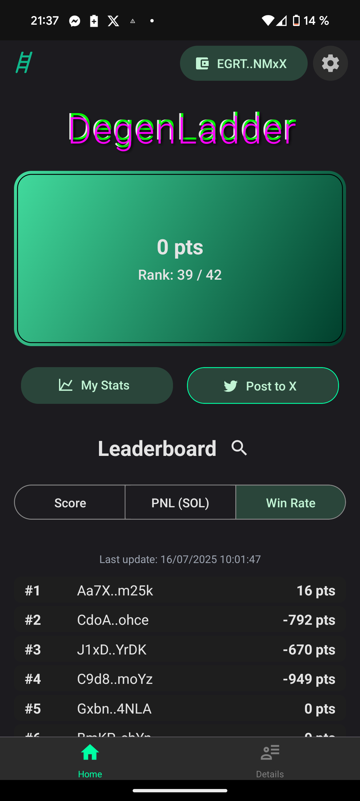
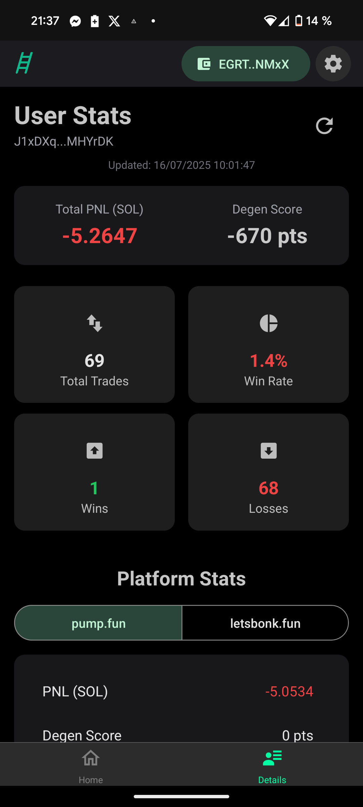

# DegenLadder

  

## 🚀 Project participating in the [Solana Mobile Hackathon](https://solanamobile.radiant.nexus/)

DegenLadder is a Solana Mobile app that ranks Solana traders based on their performance across different platforms (pump.fun, letsbonk.fun, more coming soon).

On-chain trading is a real PVP (Player vs Player) game, but how do you know who's winning and who's losing in the trenches ? DegenLadder finally provides the answer !

- Real-time leaderboard
- Detailed statistics per user and platform
- Manual or automatic data refresh
- GDPR-compliant account deletion
- 100% open source, public data only

## 📱 App Preview

  
  

## 📦 Project Structure
- `backend/` : Node.js API, worker, scripts, Supabase integration
- `frontend/` : React Native (Expo) app, components, navigation, assets
- `cursor-rules/` : AI context and roadmap

## Partnerships

Contact us at degenladderapp-partnerships@gmail.com

## 📝 License
MIT 